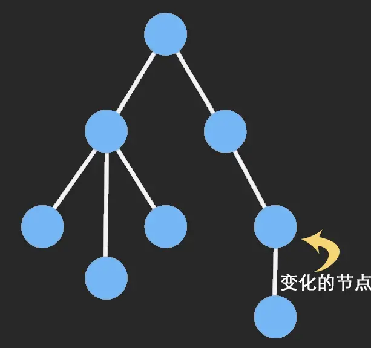

[TOC]

# 不可变数据

## 可变数据（mutable Data）
原生js创建数据类型就是可变的，可以随便修改，`const`只是浅层次的防篡改，对于引入数据类型就没辙了，如
```js
    const obj = {a:10,b:20}
    obj.a = 100;
```

引入数据是靠**共享地址**来共享值的，好处是节省内存，坏处是稍微不注意就会导致改A坏B的棘手问题
```js
    const a = {qty:1}
    const b = a;
    a.qty = 10;

    console.log(b.qty);//10
```
> 用深拷贝来解决这个问题？又会引发新的问题：浪费内存，还有对一些需要频繁更新数据又有高性能要求的场景（如：React），深拷贝实则为一个不明智的操作，`Imutable.js`的出现就是要解决这些开发痛点的


## Immutable.js 不可变数据

由Facebook 工程师 Lee Byron 花费 3 年时间打造，在js中的引用赋值可以节省内存，但随着应用的不断复杂后，状态的改变往往会变成噩梦，通常的做法是**复制数据**来避免被修改，但这样又造成了CPU和内存的消耗，而Immutable利用**结构共享**可以很好地解决这些问题。

* 复制数据：shallowCopy或deepCopy
    > 深拷贝与浅拷贝的区别 
* 结构共享：指没有改变的数据共用一个引用，这样既减少了深拷贝的性能消耗，也减少了内存


**Immutable Data** 是一旦创建，就不能再被更改的数据。对 Immutable 对象的任何修改或添加删除操作都会返回一个新的 Immutable 对象。Immutable 实现的原理是 Persistent Data Structure（持久化数据结构）

<!--  -->


### Immutable数据类型

* List: 有序索引集，类似JS中的Array。
* Map: 无序索引集，类似JS中的Object。
* OrderedMap: 有序的Map，根据数据的set()进行排序。
* Set: 没有重复值的集合。
* OrderedSet: 有序的Set，根据数据的add进行排序。
* Stack: 有序集合，支持使用unshift()和shift()添加和删除。
* Record: 一个用于生成Record实例的类。类似于JavaScript的Object，但是只接收特定字符串为key，具有默认值。
* Seq: 序列，但是可能不能由具体的数据结构支持。
* Collection: 是构建所有数据结构的基类，不可以直接构建。

### 属性
* size 
    > 获取List/Map的长度，等同于`ImmutableData.count()`;

### 方法

#### 通用方法
* `fromJS(value [,converter])`
    > 将一个js数据转换为Immutable类型的数据

* `toJS()`
    > 将一个Immutable数据转换为JS类型的数据，也可以通过`JSON.stringify()`把immutable转成json字符串

> 注意：`fromJS()`和`toJS()`会深度转换数据，随之带来的开销较大，尽可能避免使用，单层数据转换使用`Map()`和`List()`

#### Map&List共用方法
> Immutable数据的增删改并不会修改原数据，而是返回新的数据

* `get(key)/getIn(keys)`
    > 获取数据结构中的数据，对于深层属性的获取不用考虑属性不需要判空处理，直接返回undefined

* `set(key,val)/setIn(keys,val)`
    > 设置List/Map类型的键值

* `delete(key)/deleteIn(keys)`
    > 删除属性

* `update(key,val=>newValue)/updateIn(keys,val=>newValue)`
    > 更新值

* `Immutable.is(map1,map2)`
    > 判断两个对象是否一致，对两个对象的`hashCode`和`valueOf`进行比较（js中是比较两个对象的地址）

* `merge()/mergeDeep()` 
    > 合并数据
    ```js
        const imA = Map({
            username:'马云',
            money:150000000000,
            info:{
                married:true,
                witticism:'我没见过钱，我对钱不感兴趣'
            }
        })
        const imB = Map({
            username:'laoxie',
            gender:'男',
            info:{
                married:false,
                age:18,
            }
        })
        const newImData = imA.merge(imB);
        console.log(newImData.toJS());
        //输出 ：{username:'laoxie',gender:'男',money:150000000000,info:{married:false,age:18}}

        const newImData = imA.mergeDeep(imB);
        //输出 ：{username:'laoxie',gender:'男',money:150000000000,info:{married:false,age:18,witticism:'我没见过钱，我对钱不感兴趣'}}
    ```

* `has(key)/hasIn(keys)`
判断是否存在某一个key，

#### List专属方法
* `push()`
在List末尾插入一个元素

* `pop()`
在List末尾删除一个元素

* `unshift()`
在List首部插入一个元素

* `shift()`
在List首部删除一个元素

* `insert(index,item)`

* filter()
* find()
* map()
* forEach()


### immutable.js使用过程中的一些注意点


* js是弱类型，但Map类型的key必须是string！（也就是我们取值是要用get('1')而不是get(1)）
* 所有针对immutable变量的增删改必须左边有赋值，因为所有操作都不会改变原来的值，只是生成一个新的变量
* 获取深层深套对象的值时不需要做每一层级的判空(JS中如果不判空会报错，immutable中只会给undefined)
* immutable对象直接可以转JSON.stringify(),不需要显式手动调用toJS()转原生
* 判断对象是否是空可以直接用size
* 调试过程中要看一个immutable变量中真实的值，可以chrome中加断点，在console中使用.toJS()方法来查看
